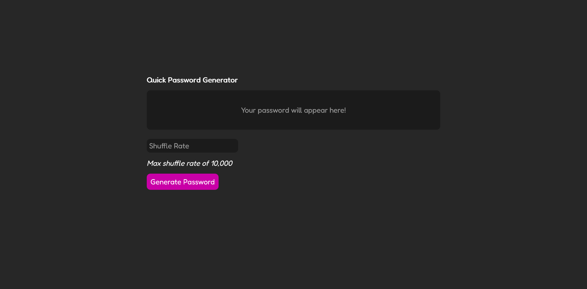
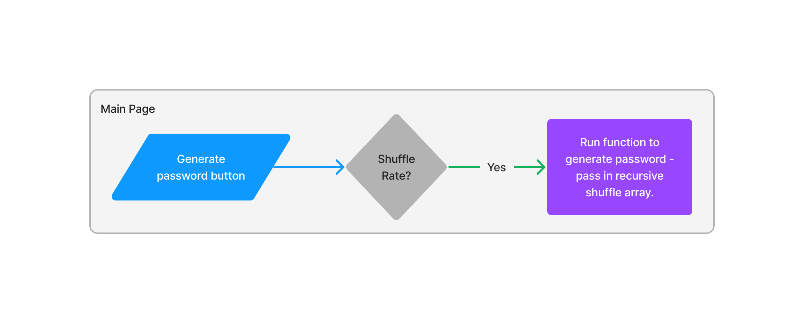

# Quick Password Generator
***

# Description
This is a newer version of my previous password generator. Not only did I give it a fresh new coat of paint, but also used this revamp as a way to exercise my understanding of recursive functions. I also reworked my password generator in wake of Hive System's [recent password security table](https://www.hivesystems.io/blog/are-your-passwords-in-the-green?utm_source=header), it would take a computer 438 trillion years to brute force an 18-character password with upper case and lower case letters, numbers, and symbols. This password generator is created with this criteria in mind, including an experimental shuffle rate feature.

# Links

[Deployed Page](https://staticcloud.github.io/Password-Generator/)

# Overview

Here's an overview of the app!

