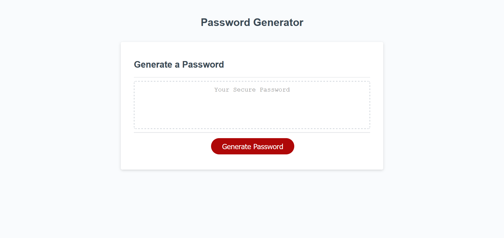

# Password-Generator
***

# Description
In this challenge, I had to complete a password generator. The HTML and CSS are already complete, my job was to handle actually generating the password. It was important to know how long the password was supposed to be, including what types of characters to include (uppercase, lowercase, special, numeric). One this information was obtained through the user via prompts, the password would appear inside the box.

# Links

[Deployed Page](https://staticcloud.github.io/Password-Generator-Challenge/)
